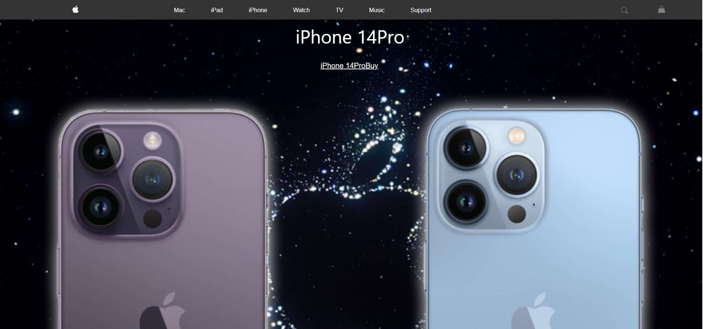

Apple Website Clone

This is a small HTML and CSS project created as the first project in your bootcamp. The goal of this project is to create a clone of the Apple website using HTML for structure and CSS for styling.

Project Structure
The project consists of the following files and directories:

index.html: This is the main HTML file that serves as the entry point for the website. It contains the structure and content of the website.

styles.css: This is the CSS file that is linked to the index.html file. It contains the styles and layout rules that define the visual appearance of the website.

images and icones: This directory contains all the image files used in the project. 

